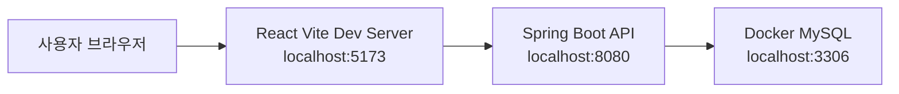
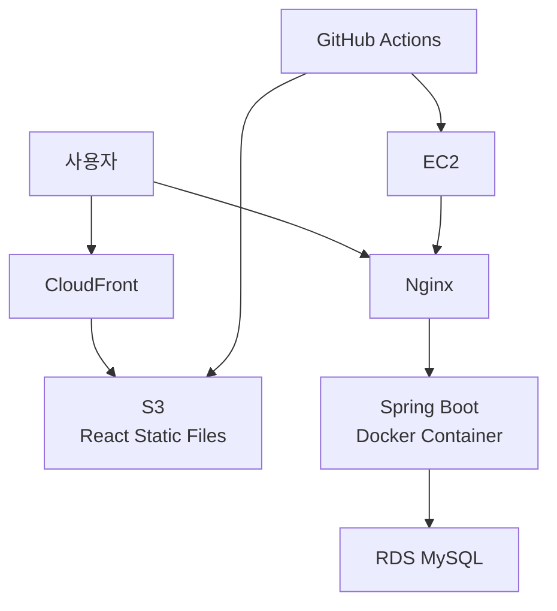
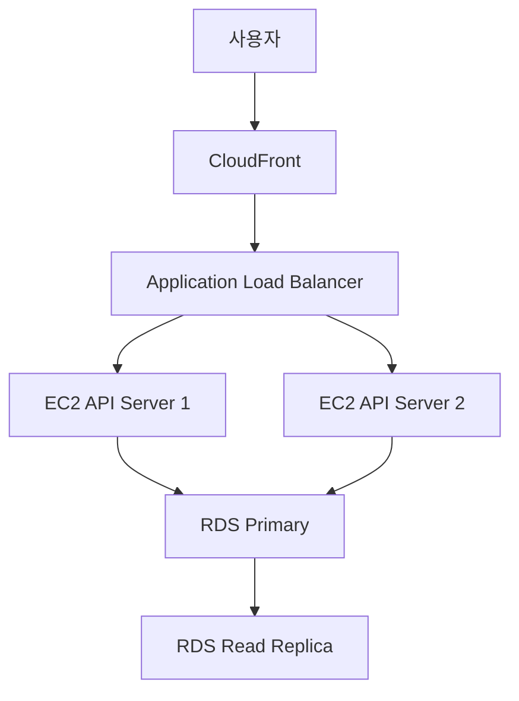
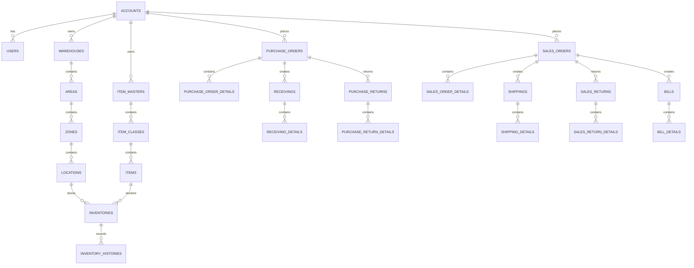

# SaaS WMS Demo

> OMS + WMS 업무 흐름을 기반으로 구현한 물류창고 운영 관리 시스템


---

## 프로젝트 소개

**SaaS WMS Demo**는 물류 운영에서 자주 사용되는 **OMS(Order Management System)** 와 **WMS(Warehouse Management System)** 의 핵심 흐름을 하나의 서비스로 구성한 데모 프로젝트입니다.

구매주문, 입고, 재고, 판매주문, 출고, 반품, 청구까지 이어지는 물류 업무 흐름을 직접 구현하며 Java/Spring Boot, React, MySQL, Docker, AWS 기반 배포 구조를 학습하고 포트폴리오로 설명할 수 있도록 설계했습니다.

실무 시스템의 업무 구조를 참고하되 회사 내부 로직, 민감 정보, 특정 산업군 전용 로직은 제외하고 범용 물류창고 관리 시스템으로 재구성했습니다.

---

## 프로젝트 개요

### 배경

물류 시스템은 주문, 입고, 재고, 출고, 청구가 서로 분리되어 있으면 운영 흐름을 추적하기 어렵습니다.

특히 창고 현장에서는 다음과 같은 문제가 자주 발생합니다.

- 창고, Area, Zone, Location 기준의 위치정보 관리가 어려움
- 입고/출고 처리 결과가 재고와 이력에 즉시 연결되지 않음
- 주문 상태와 창고 작업 상태를 한 화면에서 확인하기 어려움
- 출고 완료 이후 청구서 생성 흐름이 수작업으로 분리됨
- 거래처, 사용자, 권한, 기준정보가 일관된 구조로 관리되지 않음

### 목표

이 프로젝트는 위 문제를 해결하기 위해 다음 목표를 기준으로 구현합니다.

- OMS + WMS 기본 업무 흐름을 하나의 데모 서비스로 구성
- SaaS형 멀티테넌트 구조를 단순화해 `top_account_id` 기반 데이터 범위 관리
- TOAST UI Grid 기반 운영 화면 구현
- 창고 기준의 `Warehouse -> Area -> Zone -> Location` 위치 계층 관리
- 입고/출고 확정 시 재고 및 이력 자동 반영
- 출고 완료 시 청구서 자동 생성
- GitHub Actions 기반 백엔드/프론트엔드 빌드 검증
- AWS 배포를 고려한 3-Tier Architecture 설계

---

## 주요 기능

### 기준정보 관리

- 거래처 및 사용자 관리
- 창고, Area, Zone, Location 4단계 위치정보 관리
- 창고 생성 시 기본 Area, Zone, Location 자동 생성
- 품목 마스터, 품목 클래스, 품목 기준정보 관리
- 공통코드 기반 역할, 상태, 유형 코드 관리

### OMS

- 구매주문 조회/등록/수정
- 판매주문 조회/등록/수정
- 구매반품, 판매반품 관리
- 주문 상태 기반 후속 업무 연결

### WMS

- 구매주문 기반 입고 관리
- 판매주문 기반 출고 관리
- 입고 확정 시 재고 증가 및 재고 이력 생성
- 출고 확정 시 재고 차감 및 청구서 자동 생성
- 반품 확정 시 반품 유형에 따른 재고 반영

### 재고 관리

- 품목 + Location 기준 현재고 조회
- 가용 재고 계산
- 재고 이력 조회
- 재고 조정 및 사유 기록

### 청구 관리

- 출고 확정 기준 청구서 자동 생성
- 청구 헤더 및 상세 라인 조회
- 청구 상태 관리 기반 확장 고려

### 화면/UX

- 로그인 전 서비스 소개 페이지
- 게스트 시연 로그인
- 위드웍스 업무 화면 패턴을 참고한 검색 조건 + 탭 + 그리드 구조
- TOAST UI Grid 셀 테두리, 더블클릭 상세 이동, 감사 컬럼 표시
- 모든 그리드 마지막 컬럼에 등록자, 등록일자, 수정자, 수정일자 표시

---

## 접속 주소

> 실 배포 이후 입력 예정

| 구분 | 주소 | 계정 |
| --- | --- | --- |
| 서비스 페이지 |  |  |
| 관리자/운영 화면 |  |  |
| Swagger UI |  |  |

### 로컬 실행 주소

| 구분 | 주소 |
| --- | --- |
| Frontend | `http://localhost:5173` |
| Backend API | `http://localhost:8080` |
| Swagger UI | `http://localhost:8080/swagger-ui.html` |
| OpenAPI Docs | `http://localhost:8080/v3/api-docs` |

---

## 기술 스택

### Frontend

| 기술 | 사용 목적 |
| --- | --- |
| React 19 | SPA 화면 구현 |
| Vite 8 | 프론트엔드 개발 서버 및 빌드 |
| TOAST UI Grid | 업무 그리드 |
| Recharts | 대시보드 차트 |
| Lucide React | 아이콘 |
| Tailwind CSS | 유틸리티 스타일 기반 구성 |

### Backend

| 기술 | 사용 목적 |
| --- | --- |
| Java 21 | 백엔드 개발 언어 |
| Spring Boot 3.5.x | 애플리케이션 프레임워크 |
| Spring Web | REST API |
| Spring Data JPA | ORM 및 데이터 접근 |
| Spring Security | 인증/인가 |
| OAuth2 Client | Google/Kakao 로그인 연동 |
| JWT | Stateless 인증 |
| Springdoc OpenAPI | Swagger 문서 |
| Lombok | 반복 코드 감소 |

### Database / Infra

| 기술 | 사용 목적 |
| --- | --- |
| MySQL 8.0 | 운영 데이터 저장 |
| Docker Compose | 로컬 MySQL 및 컨테이너 실행 |
| GitHub Actions | CI 빌드 검증 |
| AWS EC2 | 백엔드 배포 예정 |
| AWS RDS | 운영 DB 예정 |
| AWS S3 | 프론트 정적 파일 배포 예정 |
| AWS CloudFront | CDN 및 HTTPS 예정 |
| Nginx | Reverse Proxy 예정 |

---

## 시스템 아키텍처

### Local Development



### Production Plan



### 확장 설계

초기 배포는 비용을 고려해 단일 EC2로 시작하되, 설계 문서에는 다음 확장 구조를 고려합니다.



---

## ERD



### 주요 테이블

| 구분 | 테이블 |
| --- | --- |
| 공통 | `accounts`, `users`, `common_codes` |
| 위치정보 | `warehouses`, `areas`, `zones`, `locations` |
| 품목정보 | `item_masters`, `item_classes`, `items` |
| OMS | `purchase_orders`, `purchase_order_details`, `sales_orders`, `sales_order_details` |
| WMS | `receivings`, `receiving_details`, `shippings`, `shipping_details` |
| 재고 | `inventories`, `inventory_histories` |
| 반품 | `purchase_returns`, `purchase_return_details`, `sales_returns`, `sales_return_details` |
| 청구 | `bills`, `bill_details` |

---

## Swagger

Spring Boot 실행 후 아래 주소에서 API 문서를 확인할 수 있습니다.

> [Swagger UI 바로가기](http://localhost:8080/swagger-ui.html)

```text
http://localhost:8080/swagger-ui.html
http://localhost:8080/v3/api-docs
```

배포 이후 운영 Swagger 주소는 접속 주소 섹션에 추가할 예정입니다.

---

## 프로젝트 상세문서

> 문서 링크는 정리 후 추가 예정

| 문서 | 링크 |
| --- | --- |
| 프로젝트 기획서 |  |
| 요구사항 정의서 |  |
| 화면 설계서 |  |
| API 명세서 |  |
| ERD 상세 문서 |  |
| 인프라 설계서 |  |
| 배포 가이드 |  |
| 회고/트러블슈팅 |  |

---

## 로컬 실행 방법

### 1. MySQL 실행

```bash
docker compose up -d mysql
```

### 2. Backend 실행

```bash
cd backend
gradlew.bat bootRun
```

### 3. Frontend 실행

```bash
cd frontend
npm install
npm run dev
```

---

## CI

GitHub Actions는 `main` 브랜치 push 및 pull request 시 실행됩니다.

| Job | 내용 |
| --- | --- |
| Backend Build & Test | JDK 21 설정, Gradle build, Docker image build |
| Frontend Build | Node.js 22 설정, npm ci, Vite build, Docker image build |

---

## 개발 컨벤션

### Commit Message

```text
[type] 한글 작업 설명
```

예시:

```text
[feat] 창고 생성 시 기본 위치 계층 자동 생성
[style] 그리드 감사 컬럼을 마지막에 표시
[fix] 게스트 시연 계정의 저장 권한 허용
```

### Code Convention

- Controller는 Entity를 직접 반환하지 않고 Response DTO로 변환합니다.
- 업무 목록 변환은 학습과 디버깅 편의를 위해 명시적인 흐름을 우선합니다.
- 업무 구분값은 Java Enum보다 `common_codes` 기반 문자열 코드로 관리합니다.
- 화면 그리드는 TOAST UI Grid를 사용합니다.
- 운영 화면은 검색 조건, 탭, 그리드, 상세 폼 구조를 표준으로 사용합니다.

