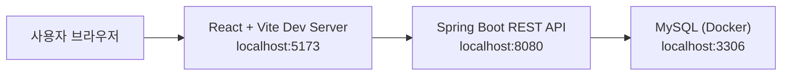
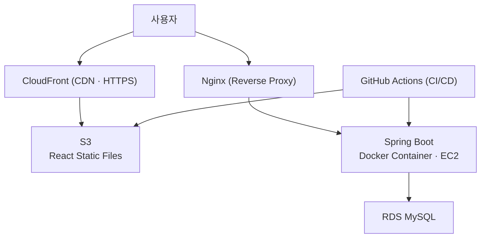
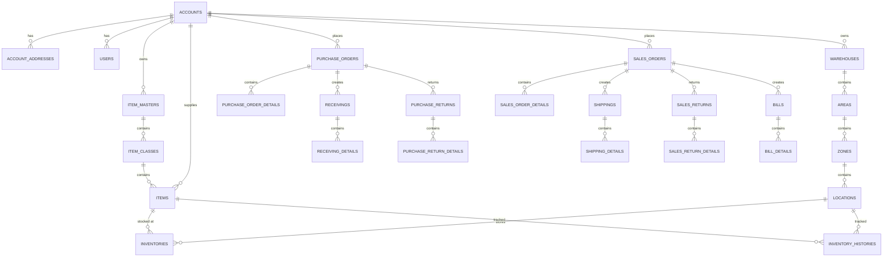

<div align="center">

# 📦 SaaS WMS Demo

### OMS + WMS 업무 흐름을 하나로 잇는 클라우드 물류창고 운영 관리 시스템

기준정보부터 주문 · 입고 · 재고 · 출고 · 반품 · 청구까지<br/>
실무 물류 업무 흐름을 SaaS 멀티테넌트 구조로 재구성한 포트폴리오 프로젝트입니다.

<br/>


</div>

<br><br>

## 📘 프로젝트 소개

<br>

**SaaS WMS Demo**는 물류 운영의 핵심인 **OMS(Order Management System)** 와 **WMS(Warehouse Management System)** 의 업무 흐름을 하나의 서비스로 구성한 데모 프로젝트입니다. <br/>

구매주문 → 입고 → 재고 → 판매주문 → 출고 → 반품 → 청구로 이어지는 물류 업무 흐름을 직접 구현하고,
**`top_account_id` 기반의 SaaS 멀티테넌트 구조**로 여러 기업이 한 시스템을 공유하면서도 데이터가 서로 격리되도록 설계했습니다.

실무 시스템의 업무 구조를 참고하되 회사 내부 로직 · 민감 정보 · 특정 산업군 전용 로직은 제외하고,
**범용 물류창고 관리 시스템**으로 재구성하여 포트폴리오로 설명할 수 있도록 만들었습니다.

<br><br><br>

## 📈 프로젝트 개요

<br>

### 🔍 배경

물류 시스템은 주문 · 입고 · 재고 · 출고 · 청구가 서로 분리되어 있으면 운영 흐름을 추적하기 어렵습니다.
특히 창고 현장에서는 다음과 같은 문제가 반복됩니다.

- 창고 · Area · Zone · Location 기준의 **위치정보 관리**가 어려움
- 입고/출고 처리 결과가 **재고와 이력에 즉시 연결되지 않음**
- 주문 상태와 창고 작업 상태를 **한 화면에서 확인하기 어려움**
- 출고 완료 이후 **청구서 생성 흐름이 수작업으로 분리**됨
- 거래처 · 사용자 · 권한 · 기준정보가 **일관된 구조로 관리되지 않음**

<br/>

### 🧩 솔루션

위 문제를 해결하기 위해 다음을 목표로 구현했습니다.

#### 1) OMS + WMS 통합 업무 흐름

- 구매주문부터 청구까지 하나의 데모 서비스로 연결
- 입고/출고/반품 **확정 시 재고와 재고 이력 자동 반영**
- 출고 확정 시 **청구서 자동 생성**

#### 2) SaaS 멀티테넌트 구조

- `top_account_id` 기반으로 기업별 데이터 범위 격리
- JWT 인증 + 역할(ADMIN/STAFF/GUEST) 기반 접근 제어
- 가입 기업이 별도 개발 없이 기준정보를 직접 등록 · 운영

#### 3) 위치 계층 기반 창고 관리

- `Warehouse → Area → Zone → Location` 4단계 위치 계층
- 창고 생성 시 **기본 Area · Zone · Location 자동 생성**

#### 4) 일관된 운영 화면 패턴

- 검색조건 + 탭 + 그리드 + 상세 폼의 표준 운영 화면
- 상위 기준정보를 **공통 조회 팝업**으로 선택 (거래처 · 창고 · 품목 등)
- TOAST UI Grid 기반의 감사 컬럼(등록자/일시 · 수정자/일시) 표준화

<br><br>

## 🌟 주요 기능

<br>

### 🍀 기준정보 관리

- **거래처(고객사/공급사)** 등록 · 수정 · 검색 + 조회 팝업
- **위치정보** — 창고 · Area · Zone · Location 4단계 계층 관리 (상위 종속 필터링)
- **품목정보** — 품목 마스터 → 품목 클래스 → 품목 3계층 관리, 품목에 공급처 연결
- 공통코드 기반 역할 · 상태 · 유형 코드 관리

### 🍀 주문 관리 (OMS)

- 구매주문 / 판매주문 조회 · 등록 · 수정
- 구매반품 / 판매반품 관리
- 주문 상태 기반 후속 업무 연결

### 🍀 입출고 관리 (WMS)

- 구매주문 기반 **입고**, 판매주문 기반 **출고**
- 입고 확정 → 재고 증가 + 재고 이력 생성
- 출고 확정 → 재고 차감 + 청구서 자동 생성
- 반품 확정 → 반품 유형에 따른 재고 반영

### 🍀 재고 관리

- 품목 + Location 기준 현재고 / 가용 재고 조회
- 재고 이력 추적 (입고 · 출고 · 반품 · 조정)

### 🍀 청구 관리

- 출고 확정 기준 청구서 자동 생성
- 청구 헤더 + 상세 라인 조회

### 🍀 대시보드 / UX

- 로그인 전 서비스 소개 페이지 + 게스트 시연 로그인
- 운영 지표 실시간 대시보드 (Recharts)
- 검색조건 + 탭 + 그리드 + 상세 폼의 일관된 화면 구조

<br><br>

## 🌐 접속 주소

<br>

> 실 배포 이후 입력 예정

| 구분 | 주소 | 계정 |
| --- | --- | --- |
| 서비스 페이지 |  |  |
| 관리자 / 운영 화면 |  |  |
| Swagger UI |  |  |

### 💻 로컬 실행 주소

| 구분 | 주소 |
| --- | --- |
| Frontend | `http://localhost:5173` |
| Backend API | `http://localhost:8080` |
| Swagger UI | `http://localhost:8080/swagger-ui/index.html` |
| OpenAPI Docs | `http://localhost:8080/v3/api-docs` |

<br><br>

## 🧰 기술 스택

<br>

### Frontend

<div>
  
  
  
  
  
</div>

### Backend

<div>
  
  
  
  
  
  
</div>

### Database / Infra

<div>
  
  
  
  
  
  
</div>

<br>

<details>
<summary>📋 기술 선택 상세 보기</summary>

<br>

| 구분 | 기술 | 사용 목적 |
| --- | --- | --- |
| Frontend | React 19 / Vite 8 | SPA 화면 구현 및 개발 서버 · 빌드 |
| Frontend | TOAST UI Grid | 업무용 데이터 그리드 |
| Frontend | Recharts | 대시보드 차트 |
| Frontend | Tailwind CSS / Lucide React | 스타일 · 아이콘 |
| Backend | Java 21 / Spring Boot 3.5.14 | 애플리케이션 프레임워크 |
| Backend | Spring Web / Spring Data JPA | REST API · ORM |
| Backend | Spring Security / OAuth2 / JWT | 인증 · 인가 (Google · Kakao 소셜 로그인) |
| Backend | Springdoc OpenAPI / Lombok | API 문서 · 보일러플레이트 감소 |
| Infra | MySQL 8 / Docker / GitHub Actions | DB · 컨테이너 · CI 빌드 검증 |
| Infra | AWS (EC2 · RDS · S3 · CloudFront) / Nginx | 배포 예정 |

</details>

<br><br>

## 🏗️ 시스템 아키텍처

<br>

### 🔹 Local Development



### 🔹 Production Plan



<br><br>

## 🛢️ ERD

<br>



### 📑 주요 테이블

| 구분 | 테이블 |
| --- | --- |
| 공통 | `accounts`, `account_addresses`, `users`, `common_codes` |
| 위치정보 | `warehouses`, `areas`, `zones`, `locations` |
| 품목정보 | `item_masters`, `item_classes`, `items` |
| OMS | `purchase_orders`, `purchase_order_details`, `sales_orders`, `sales_order_details` |
| WMS | `receivings`, `receiving_details`, `shippings`, `shipping_details` |
| 재고 | `inventories`, `inventory_histories` |
| 반품 | `purchase_returns`, `purchase_return_details`, `sales_returns`, `sales_return_details` |
| 청구 | `bills`, `bill_details` |

> 모든 업무 테이블은 `accounts`의 `top_account_id`를 기준으로 데이터 범위가 격리됩니다.

<br><br>

## 🖥 Swagger

<br>

Spring Boot 실행 후 아래 주소에서 API 문서를 확인할 수 있습니다.

> [Swagger UI 바로가기](http://localhost:8080/swagger-ui/index.html)

```text
http://localhost:8080/swagger-ui/index.html   # Swagger UI
http://localhost:8080/v3/api-docs              # OpenAPI Docs
```

배포 이후 운영 Swagger 주소는 **접속 주소** 섹션에 추가할 예정입니다.

<br><br>

## 📄 프로젝트 상세 문서

<br>

> 문서는 정리 후 링크를 추가할 예정입니다.

| 문서 | 링크 |
| --- | --- |
| 📌 프로젝트 기획서 |  |
| 📌 요구사항 정의서 |  |
| 📌 화면 설계서 |  |
| 📌 API 명세서 |  |
| 📌 ERD 상세 문서 |  |
| 📌 인프라 설계서 |  |
| 📌 회고 / 트러블슈팅 |  |

<br>
