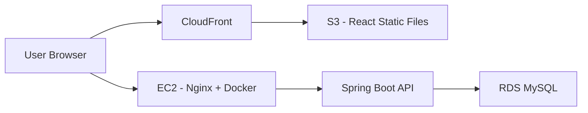
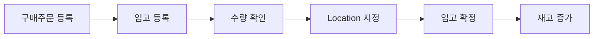
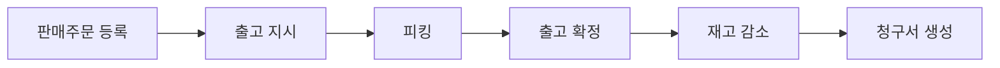
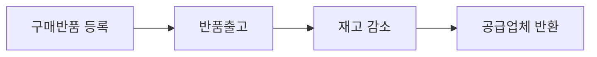
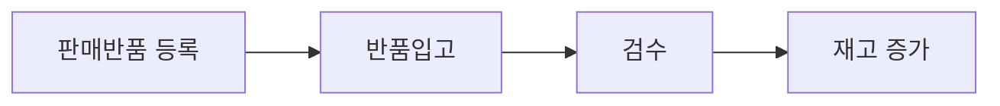
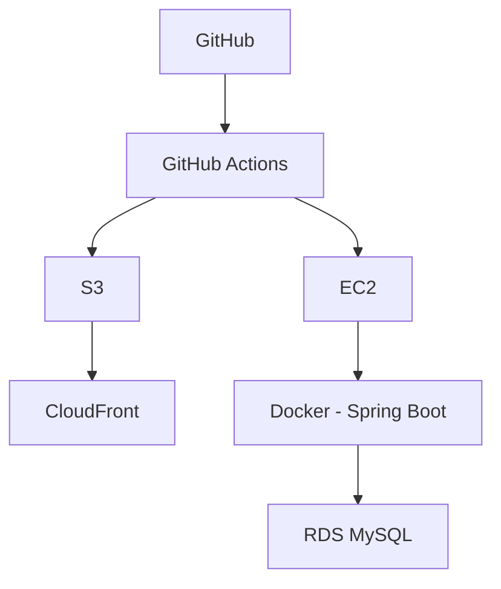
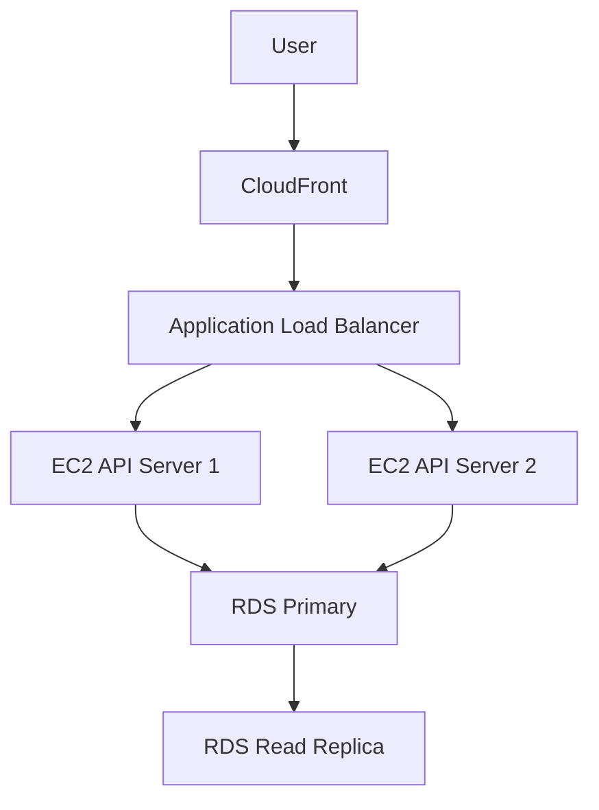
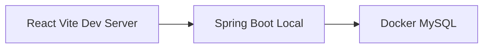

# SaaS WMS Demo

## 1. Project Overview

SaaS WMS Demo는 실제 OMS + WMS 업무 흐름을 기반으로 만든 포트폴리오용 물류창고 관리 시스템이다.

실무 물류 시스템의 업무 개념을 참고하되, 회사 내부 로직과 민감 정보는 제외하고 Java, React, MySQL, AWS 기반의 3-Tier Architecture로 새롭게 구현한다.

### 목표

- Java/Spring Boot 백엔드 개발 역량 향상
- JPA 기반 도메인 모델링 학습
- React 기반 프론트엔드 구현
- MySQL을 활용한 OMS/WMS 데이터 설계
- AWS 인프라 배포 경험 확보
- Docker, CI/CD, CloudFront, EC2, RDS 등 포트폴리오에 설명 가능한 인프라 구성
- GitHub Actions 기반 빌드 검증 및 배포 자동화 경험 확보

### 프로젝트 성격

- 포트폴리오용 데모 프로젝트
- 범용 물류창고 업무 기준
- 특정 산업군의 특수 로직은 제외
- OMS + WMS의 기본 업무 흐름 구현
- 로그인 없이 프로젝트 설명을 볼 수 있는 랜딩 페이지 제공
- Google/Kakao OAuth 및 게스트 로그인 제공
- SaaS형 멀티테넌트 구조를 단순화해 구현

---

## 2. Tech Stack

### Frontend

- React
- Vite
- Tailwind CSS
- React Router
- Axios
- Chart library: Recharts 또는 Chart.js 예정

### Backend

- Java 21
- Spring Boot 3.x
- Gradle
- Spring Web
- Spring Data JPA
- Spring Security
- OAuth2 Client
- JWT
- Validation
- Lombok

### Database

- MySQL 8.0
- 개발 환경: Docker Compose 기반 로컬 MySQL
- 운영 환경: AWS RDS MySQL

### Infrastructure

- AWS S3: React 정적 파일 호스팅
- AWS CloudFront: CDN 및 HTTPS
- AWS EC2: Spring Boot API 서버
- AWS RDS: MySQL DB 서버
- Docker: Spring Boot 백엔드 컨테이너 실행
- Nginx: EC2 내부 reverse proxy
- GitHub Actions: CI/CD

---

## 3. Architecture

이 프로젝트는 3-Tier Architecture를 기준으로 구성한다.



### Tier 구성

| Tier | 역할 | 기술 |
| --- | --- | --- |
| Presentation Tier | 화면, 라우팅, 사용자 입력 | React, Vite, Tailwind CSS |
| Application Tier | 인증, 비즈니스 로직, API | Spring Boot, Spring Security, JPA |
| Data Tier | 데이터 저장 및 조회 | MySQL, RDS |

---

## 4. Landing Page Plan

로그인 전 메인 화면은 단순 로그인 페이지가 아니라, 프로젝트를 설명하는 포트폴리오 랜딩 페이지로 구성한다.

### 목적

- 이 프로젝트가 어떤 시스템인지 설명
- OMS/WMS 기본 개념 설명
- 시연 방법 안내
- 게스트 로그인 제공
- 기술 스택과 인프라 구조 소개

### 구성

| Tab | 내용 |
| --- | --- |
| 서비스 소개 | 프로젝트 목적, OMS + WMS 개요 |
| 주요 기능 | 기준정보, 주문, 입고, 출고, 재고, 청구 기능 소개 |
| 물류 기본 지식 | WMS, OMS, 입고, 출고, 재고, 로케이션 개념 설명 |
| 시연 가이드 | 게스트 계정, 추천 테스트 흐름 안내 |
| 기술/인프라 | Java, React, MySQL, AWS, Docker 구조 설명 |

### 로그인 버튼

- Google OAuth 로그인
- Kakao OAuth 로그인
- 게스트 로그인

---

## 5. Screen Plan

### Public Area

| No | 화면 | 설명 |
| --- | --- | --- |
| 0 | 랜딩/로그인 | 프로젝트 소개, 탭 콘텐츠, OAuth 로그인, 게스트 로그인 |

### Dashboard

| No | 화면 | 설명 |
| --- | --- | --- |
| 1 | 대시보드 | 오늘 입고/출고, 주문 현황, 재고 부족 알림, 월별 입출고 차트 |

### Master Data

| No | 화면 | 설명 |
| --- | --- | --- |
| 2 | 창고 관리 | 창고 CRUD |
| 3 | 위치 관리 | 창고, Area, Zone, Location 4단계 위치 체계 관리 |
| 4 | 품목 마스터 | 대분류 관리 |
| 5 | 품목 클래스 | 중분류 관리, 품목 마스터 하위 구조 |
| 6 | 품목 관리 | 실제 SKU 관리, 바코드, 단가, 품목 클래스 연결 |
| 7 | 거래처 관리 | 공급업체/고객 거래처 관리 |
| 8 | 사용자 관리 | 사용자 목록, 역할 설정, Admin 전용 |

### OMS - Purchase

| No | 화면 | 설명 |
| --- | --- | --- |
| 9 | 구매주문 | PO 등록, 조회, 수정, 상태 관리 |
| 10 | 구매반품 | 구매주문 기준 반품 등록 및 처리 |

### OMS - Sales

| No | 화면 | 설명 |
| --- | --- | --- |
| 11 | 판매주문 | SO 등록, 조회, 수정, 상태 관리 |
| 12 | 판매반품 | 판매주문 기준 반품 등록 및 처리 |

### WMS - Inbound

| No | 화면 | 설명 |
| --- | --- | --- |
| 13 | 입고 관리 | 구매주문 기반 입고 등록, 수량 확인, 위치 지정, 입고 확정 |
| 14 | 반품입고 관리 | 판매반품 기반 반품 입고, 검수, 재고 반영 |

### WMS - Outbound

| No | 화면 | 설명 |
| --- | --- | --- |
| 15 | 출고 관리 | 판매주문 기반 출고 지시, 피킹, 출고 확정 |
| 16 | 반품출고 관리 | 구매반품 기반 반품 출고, 재고 감소 |

### Inventory

| No | 화면 | 설명 |
| --- | --- | --- |
| 17 | 재고 현황 | 창고/위치별 재고 조회, 품목별 검색 |
| 18 | 재고 이력 | 입고, 출고, 반품, 조정 이력 조회 |
| 19 | 재고 조정 | 실사 후 재고 차이 조정, 사유 기록 |

### Billing

| No | 화면 | 설명 |
| --- | --- | --- |
| 20 | 청구서 관리 | 출고 확정 기반 청구서 자동 생성, 조회, 발행 처리 |

---

## 6. Business Flow

### Purchase Cycle



### Sales Cycle



### Purchase Return Cycle



### Sales Return Cycle



---

## 7. Status Flow

| 업무 | 상태 흐름 |
| --- | --- |
| 구매주문 | 대기 -> 일부입고 -> 입고완료 -> 마감 |
| 판매주문 | 대기 -> 출고지시 -> 일부출고 -> 출고완료 -> 청구완료 |
| 입고 | 대기 -> 입고중 -> 입고완료 |
| 출고 | 대기 -> 피킹중 -> 출고완료 |
| 구매반품 | 대기 -> 반품출고완료 |
| 판매반품 | 대기 -> 반품입고완료 |
| 청구서 | 임시 -> 발행 -> 수납완료 |

---

## 8. Database Plan

JPA Entity를 중심으로 데이터 모델을 설계한다. 개발 초기에는 Entity 설계를 통해 테이블 구조를 만들고, 안정화 이후 Flyway 도입을 고려한다.

### Master Tables

| Table | 설명 |
| --- | --- |
| common_codes | 역할, 거래처 구분, 주문 상태 등 업무 공통코드 |
| users | 사용자 |
| accounts | 거래처, 공급업체/고객 구분 |
| warehouses | 창고 |
| areas | 창고 하위 Area |
| zones | Area 하위 Zone |
| locations | Zone 하위 Location |
| item_masters | 품목 마스터, 대분류 |
| item_classes | 품목 클래스, 중분류 |
| items | 품목, 실제 SKU |

### OMS Tables

| Table | 설명 |
| --- | --- |
| purchase_orders | 구매주문 헤더 |
| purchase_order_details | 구매주문 상세 |
| purchase_returns | 구매반품 헤더 |
| purchase_return_details | 구매반품 상세 |
| sales_orders | 판매주문 헤더 |
| sales_order_details | 판매주문 상세 |
| sales_returns | 판매반품 헤더 |
| sales_return_details | 판매반품 상세 |

### WMS Tables

| Table | 설명 |
| --- | --- |
| receivings | 입고 헤더 |
| receiving_details | 입고 상세 |
| shippings | 출고 헤더 |
| shipping_details | 출고 상세 |
| inventories | 재고 |
| inventory_histories | 재고 이력 |

### Billing Tables

| Table | 설명 |
| --- | --- |
| bills | 청구서 헤더 |
| bill_details | 청구서 상세 |

---

## 9. JPA Design Direction

### SaaS형 Account 구조

이 프로젝트는 단일 회사용 시스템이 아니라 여러 고객사와 하위 거래처가 하나의 플랫폼을 함께 사용하는 SaaS형 OMS/WMS를 가정한다.

```text
Top Account
├── Account A
│   └── User 1
├── Account B
│   └── User 2
└── Account C
    └── User 3
```

설계 기준:

- 사용자는 반드시 하나의 거래처에 소속된다.
- 거래처는 최상위 조직을 의미하는 `top_account_id`를 가진다.
- 최상위 거래처는 `id == top_account_id` 구조로 관리한다.
- 업무 데이터는 기본적으로 `account_id`를 가진다.
- 조회 범위는 로그인 사용자의 `top_account_id` 기준으로 제한한다.

화면 용어:

| DB/Code 용어 | 화면 표현 |
| --- | --- |
| top_account_id | 상위 조직 |
| account_id | 소속 거래처 |
| account_type_sub_code | 거래처 구분 |
| role_sub_code | 사용자 역할 |

### Common Code 정책

실무 업무 시스템의 방향성을 반영해 Enum 대신 공통코드 테이블을 사용한다.

```text
common_codes
- id
- group_code
- sub_code
- code_name
- description
- sort_order
- use_yn
```

공통코드는 `group_code + sub_code` 조합으로 식별한다. 포트폴리오 가독성을 위해 `sub_code`는 숫자 코드가 아니라 의미 있는 문자열로 관리한다.

예시:

| group_code | sub_code | code_name |
| --- | --- | --- |
| USER_ROLE | ADMIN | 관리자 |
| USER_ROLE | STAFF | 일반 직원 |
| USER_ROLE | GUEST | 게스트 |
| ACCOUNT_TYPE | HQ | 본사 |
| ACCOUNT_TYPE | CUSTOMER | 고객사 |
| ACCOUNT_TYPE | SUPPLIER | 공급사 |
| ACCOUNT_TYPE | PARTNER | 협력사 |

### Entity 설계 원칙

- 도메인 중심으로 Entity를 먼저 설계한다.
- 단순 CRUD보다 업무 흐름을 표현하는 관계를 우선한다.
- 양방향 연관관계는 꼭 필요한 경우에만 사용한다.
- 기본 조회는 LAZY loading을 원칙으로 한다.
- 화면 응답은 Entity를 직접 반환하지 않고 DTO를 사용한다.
- 업무 구분값은 Java Enum보다 `common_codes` 기반의 문자열 코드로 관리한다.
- 주문/입고/출고/청구는 Header + Detail 구조로 설계한다.
- 재고 변경은 반드시 inventory_histories에 이력을 남긴다.

### Code Convention

초기 개발 단계에서는 Java/JPA 학습과 디버깅 편의성을 우선한다.

- Git commit message는 `[type] 한글 작업 설명` 형식을 따른다.
- 타입은 영어로 작성하고, 작업 설명은 한글로 명확하게 작성한다.
- 예: `[feat] 창고 위치정보 도메인 추가`, `[fix] GitHub Actions 백엔드 빌드 실패 수정`, `[docs] README 코드 컨벤션 정리`
- 주요 타입: `[feat]`, `[fix]`, `[docs]`, `[style]`, `[refactor]`, `[test]`, `[ci]`, `[chore]`

- 목록 변환은 `stream().map().toList()`보다 명시적인 `for`문을 우선 사용한다.
- 조회 결과, 응답 리스트, 변환 과정을 변수로 분리해 중간 상태를 확인하기 쉽게 작성한다.
- Controller에서는 Entity를 그대로 노출하지 않고 Response DTO 또는 record로 변환한다.
- 단순 조회 API도 `List<Entity> -> List<Response>` 변환 과정을 명확히 드러낸다.
- 생성자 주입은 `@RequiredArgsConstructor`와 `final` 필드를 사용한다.
- Service, Repository, Controller는 직접 Singleton 클래스를 만들지 않고 Spring Bean의 기본 Singleton scope를 사용한다.
- Java의 수동 Singleton 패턴은 특별한 이유가 있을 때만 사용한다.

예시:

```java
List<User> users = userRepository.findAllByOrderByIdAsc();
List<UserResponse> responses = new ArrayList<>();

for (User user : users) {
    UserResponse response = UserResponse.from(user);
    responses.add(response);
}

return responses;
```

### Design Pattern 방향

이 프로젝트에서 우선 적용할 디자인 패턴은 Singleton Pattern이다.

다만 Spring Boot에서는 `private static instance`와 `getInstance()`를 직접 구현하는 방식보다 Spring Container가 관리하는 Bean Singleton을 기본 방식으로 사용한다.

```text
@RestController
@Service
@Repository
@Component
```

위 어노테이션으로 등록된 객체는 기본적으로 애플리케이션 전체에서 하나의 Bean 인스턴스로 관리된다. 따라서 이 프로젝트의 Singleton Pattern은 Spring Bean Singleton을 기준으로 설명한다.

### ddl-auto 전략

| 환경 | 설정 | 설명 |
| --- | --- | --- |
| 초기 개발 | create 또는 update | 빠른 Entity 검증 |
| 기능 안정화 | validate | Entity와 DB 구조 검증 |
| 운영/배포 | validate + Flyway | 명시적 마이그레이션 관리 |

---

## 10. Infrastructure Plan

### 실제 구현 범위



### 배포 방식

#### Frontend

1. GitHub Actions에서 React build
2. build 결과물을 S3에 업로드
3. CloudFront cache invalidation

#### Backend

1. GitHub Actions에서 Gradle build
2. Docker image build
3. EC2에 배포
4. 기존 container 중지 후 새 container 실행
5. Nginx가 Spring Boot container로 reverse proxy

---

## 11. Load Balancing Strategy

초기 포트폴리오 배포에서는 비용을 고려해 단일 EC2 서버로 운영한다. 다만 설계 문서에는 확장 시 부하분산 전략을 명시한다.

### 현재 구현

| 영역 | 구성 | 부하분산 여부 |
| --- | --- | --- |
| Frontend | S3 + CloudFront | CDN 기반 분산 |
| Backend | EC2 1대 + Docker | 단일 서버 |
| Database | RDS MySQL 1대 | 단일 DB |

### 확장 전략

트래픽 증가 시 다음 구조로 확장한다.



### 확장 시 적용 항목

- Backend: ALB + EC2 Auto Scaling Group
- Database: RDS Read Replica를 통한 읽기 부하 분산
- Cache: ElastiCache Redis 도입 검토
- Session: JWT 기반 stateless 인증 유지
- Nginx: upstream 구조로 구성해 다중 API 서버 전환 가능하도록 설계

---

## 12. Local Development Plan

로컬 개발에서는 MySQL만 Docker Compose로 실행하고, Spring Boot와 React는 각각 IDE/터미널에서 직접 실행한다.



### 개발 실행 방식

Frontend:

```bash
cd frontend
npm install
npm run dev
```

Backend:

```bash
cd backend
./gradlew bootRun
```

Local MySQL:

```bash
docker compose up -d
```

### API Documentation

Spring Boot 실행 후 Swagger UI와 OpenAPI 문서를 아래 URL에서 확인한다.

```text
http://localhost:8080/swagger-ui.html
http://localhost:8080/v3/api-docs
```

Swagger UI는 백엔드 API를 브라우저에서 직접 확인하고 호출해볼 수 있는 개발용 API 문서로 사용한다.

---

## 13. Development Roadmap

### Phase 1. Project Setup

- [x] 프로젝트 폴더 생성
- [x] Spring Boot 프로젝트 생성
- [x] React 프로젝트 생성
- [x] Tailwind CSS 설정
- [x] Docker Compose MySQL 설정
- [x] Spring Boot DB 연결

### Phase 2. Domain Modeling

- [x] 공통 BaseEntity 설계
- [x] 공통코드 Entity 설계
- [x] 거래처 Entity 설계
- [x] User 기본 Entity 설계
- [x] 위치정보 Entity 설계
- [ ] 품목정보 Entity 설계
- [ ] OMS Entity 설계
- [ ] WMS Entity 설계
- [ ] Billing Entity 설계

### Phase 3. Authentication

- [ ] Spring Security 기본 설정
- [ ] Google OAuth 로그인
- [ ] Kakao OAuth 로그인
- [ ] JWT 발급/검증
- [ ] 게스트 로그인

### Phase 4. Backend API

- [ ] 기준정보 CRUD API
- [ ] 구매주문/구매반품 API
- [ ] 판매주문/판매반품 API
- [ ] 입고/반품입고 API
- [ ] 출고/반품출고 API
- [ ] 재고/이력/조정 API
- [ ] 청구서 API
- [ ] 대시보드 통계 API

### Phase 5. Frontend

- [ ] 랜딩 페이지
- [ ] 로그인/게스트 로그인
- [ ] 공통 레이아웃
- [ ] 대시보드
- [ ] 기준정보 화면
- [ ] OMS 화면
- [ ] WMS 화면
- [ ] 재고 화면
- [ ] 청구 화면

### Phase 6. Deployment

- [ ] AWS RDS 생성
- [ ] EC2 생성
- [ ] Docker 배포 구성
- [ ] S3 + CloudFront 구성
- [ ] GitHub Actions CI/CD 구성
- [ ] 운영 환경변수 구성

---

## 14. Project Directory

```text
C:\withworks_demo_project
├── backend
│   ├── src
│   ├── build.gradle
│   ├── settings.gradle
│   └── gradlew
├── frontend
│   ├── src
│   ├── package.json
│   └── vite.config.js
├── docker-compose.yml
└── README.md
```

---

## 15. Learning Notes

이 프로젝트는 단순히 완성된 코드를 만드는 것이 아니라, 직접 구현하면서 Java, JPA, Spring Security, React, AWS 인프라를 학습하기 위한 프로젝트다.

따라서 작업 방식은 다음 원칙을 따른다.

- 먼저 직접 구현한다.
- 막히는 지점은 원인을 분석한다.
- 필요한 경우에만 도움을 받아 수정한다.
- 설계 이유를 README에 계속 기록한다.
- 단순 기능 구현보다 업무 흐름과 아키텍처 이해를 우선한다.


